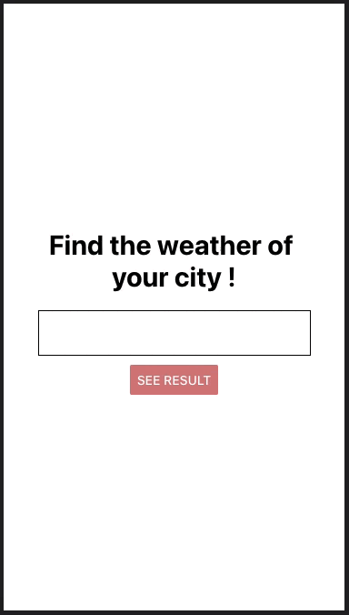

# Weather app to test React-native

---

## Setup

- Copy the .env.json.dist as .env.json
- Create an account on https://openweathermap.org/
- Set your API key in the .env.json
- `npm run start` or `yarn start`

## Demo

